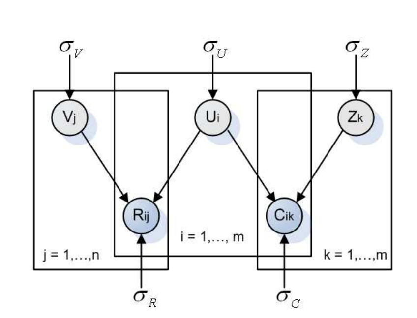

# SoRec
* Implementation of SoRec: Social Recommandation Using Probabilistic Matrix Factorisation from Hao Ma, Haixuan Yang, Michael R.Lyu, Irwin King, available [here](https://www.google.fr/url?sa=t&rct=j&q=&esrc=s&source=web&cd=1&ved=0ahUKEwiChrvl2bTQAhUFSRoKHau5AwYQFggiMAA&url=http%3A%2F%2Fciteseerx.ist.psu.edu%2Fviewdoc%2Fdownload%3Fdoi%3D10.1.1.304.2464%26rep%3Drep1%26type%3Dpdf&usg=AFQjCNGdhgogXpFzHWBl643soUxDrsxqUw&sig2=0QCkRn9hFeOs7IxB5p0uRw).

* Evaluation of model using MovieLens data.

